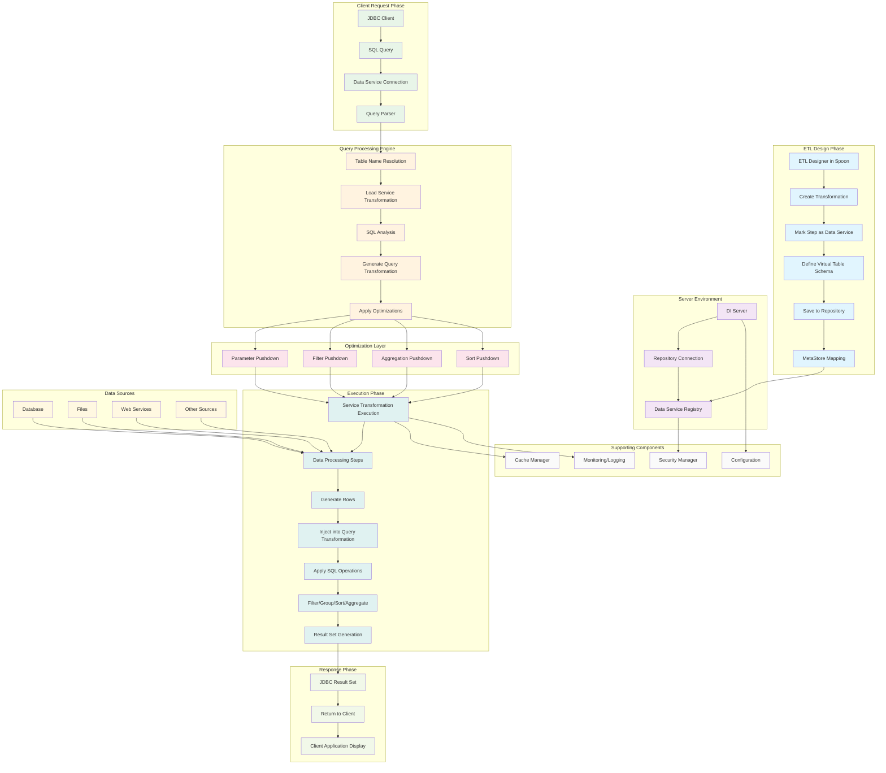
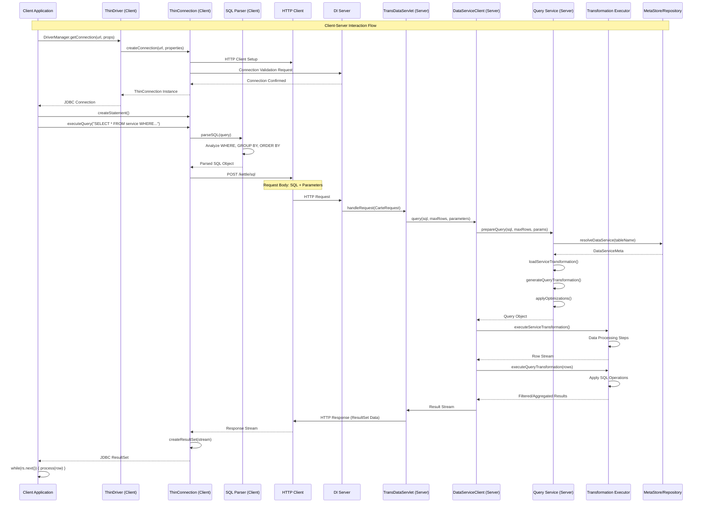
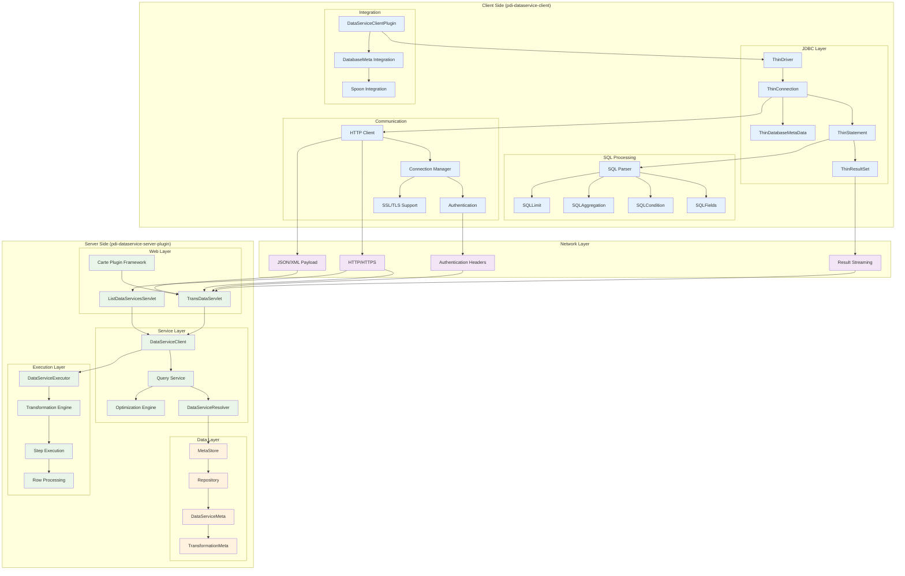

# PDI Data Service Plugin - Data Flow Diagram

## Overview
This diagram illustrates the data flow through the PDI Data Service Plugin system, from transformation creation to query execution and result delivery.

## Data Flow Diagram



## Detailed Data Flow Description

### 1. ETL Design Phase
- **ETL Designer** creates transformations in Spoon
- **Data Service Creation** involves marking specific steps as service endpoints
- **Virtual Table Schema** is defined with column names and types
- **Repository Storage** saves transformation metadata
- **MetaStore Mapping** creates virtual table to transformation relationships

### 2. Server Environment Setup
- **DI Server** connects to the repository
- **Data Service Registry** maintains available services
- **Service Discovery** enables clients to find available tables

### 3. Client Request Processing
- **JDBC Clients** (Tableau, R Studio, etc.) connect using standard JDBC
- **SQL Queries** are submitted using familiar SQL syntax
- **Connection Management** handles authentication and session management
- **Query Parsing** analyzes SQL structure and requirements

### 4. Query Processing Engine
- **Table Resolution** maps virtual table names to transformations
- **Transformation Loading** retrieves service transformation from repository
- **SQL Analysis** identifies required operations (WHERE, GROUP BY, ORDER BY)
- **Query Transformation Generation** creates execution plan
- **Optimization Application** applies performance improvements

### 5. Optimization Layer
- **Parameter Pushdown** passes query parameters to source systems
- **Filter Pushdown** applies WHERE conditions early in the pipeline
- **Aggregation Pushdown** performs grouping operations efficiently
- **Sort Pushdown** optimizes ORDER BY operations

### 6. Execution Phase
- **Service Transformation** executes with applied optimizations
- **Data Processing** runs through ETL steps (Extract, Transform, Load)
- **Row Generation** produces data from the marked service step
- **Query Transformation Injection** feeds data into SQL operations
- **SQL Operations** apply filtering, grouping, sorting, and aggregation
- **Result Set Creation** formats data for JDBC consumption

### 7. Response Phase
- **JDBC Result Set** packages data in standard format
- **Client Delivery** returns results to requesting application
- **Application Display** shows data in client tools

## Key Data Flow Characteristics

### Data Types Handled
- **Structured Data**: Database tables, CSV files
- **Semi-structured Data**: JSON, XML files
- **Streaming Data**: Real-time data feeds
- **Web Services**: REST/SOAP API responses

### Performance Optimizations
- **Lazy Loading**: Only processes data when queried
- **Query Pushdown**: Moves operations closer to data sources
- **Caching**: Stores frequently accessed results
- **Parallel Processing**: Utilizes multiple threads for execution

### Security Features
- **Authentication**: User validation through repository
- **Authorization**: Role-based access to data services
- **Data Masking**: Sensitive data protection
- **Audit Logging**: Query and access tracking

## Integration Points

### Client Integration
- Standard JDBC connectivity
- Database metadata discovery
- SQL query support
- Result set streaming

### Server Integration
- Repository-based service discovery
- OSGi plugin architecture
- Karaf bundle deployment
- Multi-tenant support

### Tool Integration
- **BI Tools**: Tableau, Power BI, QlikView
- **Analytics**: R Studio, Python, Jupyter
- **Reporting**: Pentaho Reporting, Jasper Reports
- **Data Science**: Apache Spark, Hadoop ecosystem

## PDI Data Service Client - Detailed Description

### Overview
The **PDI Data Service Client** (`pdi-dataservice-client`) is the client-side component that enables applications to connect to and query PDI Data Services using standard JDBC interfaces. It acts as a bridge between client applications and the PDI Data Service Server, providing seamless access to transformation-based virtual tables.

### Core Components

#### 1. **ThinDriver** - JDBC Driver Implementation
- **Full Class**: `org.pentaho.di.trans.dataservice.jdbc.ThinDriver`
- **Purpose**: Main JDBC driver that implements the `java.sql.Driver` interface
- **URL Format**: `jdbc:pdi://hostname:port/database/kettle`
- **Registration**: Automatically registers with `DriverManager` on class loading
- **Features**:
  - Supports standard JDBC connection establishment
  - Handles URL parsing and validation
  - Manages driver versioning (Major: 6, Minor: 0)
  - Non-JDBC compliant (returns false for `jdbcCompliant()`)

#### 2. **ThinConnection** - Connection Management
- **Full Class**: `org.pentaho.di.trans.dataservice.jdbc.ThinConnection`
- **Purpose**: Implements `java.sql.Connection` interface for data service connections
- **Key Features**:
  - URL parsing with parameter extraction
  - HTTP-based communication with DI Server
  - Connection validation and error handling
  - Builder pattern for connection configuration
  - Supports connection pooling and reuse

#### 3. **DataServiceClientPlugin** - Database Meta Plugin
- **Full Class**: `org.pentaho.di.trans.dataservice.client.DataServiceClientPlugin`
- **Purpose**: Integrates PDI Data Services as a database type in Pentaho tools
- **Annotation**: `@DatabaseMetaPlugin(type = "KettleThin", typeDescription = "Pentaho Data Services")`
- **Features**:
  - Extends `BaseDatabaseMeta` for Pentaho integration
  - Provides database-specific configuration options
  - Supports both NATIVE and JNDI access types
  - Default port: 8080
  - Enables URL options and parameters

#### 4. **SQL Processing Engine**
Located in `org.pentaho.di.core.sql` package:

##### **SQL Class** - Main SQL Parser
- **Purpose**: Parses and analyzes SQL queries
- **Capabilities**:
  - SELECT statement parsing
  - WHERE clause analysis
  - GROUP BY and ORDER BY handling
  - LIMIT and aggregation support
  - Field and table name resolution

##### **SQLFields** - Field Management
- **Purpose**: Manages field definitions and transformations
- **Features**:
  - Field aliasing and renaming
  - Data type handling
  - Calculated field support
  - Field validation and metadata

##### **SQLCondition** - Query Filtering
- **Purpose**: Handles WHERE clause conditions
- **Capabilities**:
  - Comparison operators (=, <, >, LIKE, etc.)
  - Logical operators (AND, OR, NOT)
  - Parameter binding
  - Condition optimization

##### **SQLAggregation** - Aggregation Functions
- **Purpose**: Processes GROUP BY and aggregate functions
- **Supported Functions**:
  - COUNT, SUM, AVG, MIN, MAX
  - DISTINCT operations
  - Custom aggregation logic

#### 5. **Client Service Interface**
- **Interface**: `IDataServiceClientService`
- **Implementation**: `DataServiceClient` (in server plugin)
- **Methods**:
  - `query()`: Execute SQL queries with various parameters
  - `getServiceInformation()`: Retrieve service metadata
  - `getServiceNames()`: List available data services

### Connection Flow

#### 1. **Driver Registration**
```java
// Automatic registration on class loading
static {
    new ThinDriver().register();
}
```

#### 2. **Connection Establishment**
```java
String url = "jdbc:pdi://localhost:8080/pentaho/kettle";
Properties props = new Properties();
props.setProperty("user", "admin");
props.setProperty("password", "password");
Connection conn = DriverManager.getConnection(url, props);
```

#### 3. **URL Structure**
- **Base URL**: `jdbc:pdi://`
- **Server**: `hostname:port`
- **Context**: `/database` (optional, depends on web app name)
- **Service Path**: `/kettle` (fixed service endpoint)
- **Parameters**: `?param1=value1&param2=value2`

### Key Features

#### **Standard JDBC Compliance**
- Implements core JDBC interfaces (`Driver`, `Connection`, `Statement`, `ResultSet`)
- Supports prepared statements and parameterized queries
- Provides database metadata through `DatabaseMetaData`
- Handles result set navigation and data type conversions

#### **HTTP-Based Communication**
- Uses HTTP/HTTPS for client-server communication
- Leverages Apache HttpClient for robust networking
- Supports authentication and session management
- Handles connection pooling and reuse

#### **SQL Query Processing**
- **Local SQL Parsing**: Analyzes queries on client side
- **Query Optimization**: Optimizes queries before transmission
- **Parameter Binding**: Supports parameterized queries
- **Result Streaming**: Handles large result sets efficiently

#### **Integration Capabilities**
- **Pentaho Tools**: Seamless integration with Spoon, Report Designer, Analyzer
- **Third-party Tools**: Works with Tableau, R Studio, Power BI, etc.
- **Custom Applications**: Can be embedded in Java applications
- **Database Connections**: Appears as standard database in connection dialogs

### Configuration Options

#### **Connection Properties**
- `user`: Username for authentication
- `password`: Password for authentication
- `webAppName`: Custom web application context
- `secure`: Enable HTTPS communication
- `debugMode`: Enable debug logging
- `maxRows`: Default maximum rows per query

#### **URL Parameters**
- **Authentication**: `?user=admin&password=secret`
- **Streaming**: `?streaming=true&windowSize=1000`
- **Optimization**: `?pushdown=true&cache=enabled`
- **Timeout**: `?timeout=30000&readTimeout=60000`

### Error Handling

#### **Connection Errors**
- Network connectivity issues
- Authentication failures
- Server unavailability
- Invalid URL format

#### **Query Errors**
- SQL syntax errors
- Invalid table/service names
- Data type conversion errors
- Result set processing errors

### Performance Optimizations

#### **Query Pushdown**
- WHERE clause pushdown to data sources
- Parameter binding optimization
- Aggregation pushdown when possible
- Sort operation optimization

#### **Connection Management**
- Connection pooling support
- Keep-alive mechanisms
- Automatic reconnection
- Resource cleanup

#### **Result Set Handling**
- Streaming result sets for large datasets
- Lazy loading of result metadata
- Efficient memory usage
- Configurable fetch sizes

### Security Features

#### **Authentication Support**
- Username/password authentication
- Session-based authentication
- Custom authentication providers
- Single sign-on (SSO) integration

#### **Communication Security**
- HTTPS/TLS encryption support
- Certificate validation
- Secure credential transmission
- Connection encryption

### Integration Examples

#### **Java Application**
```java
// Load driver (automatic with modern JDBC)
Class.forName("org.pentaho.di.trans.dataservice.jdbc.ThinDriver");

// Connect
Connection conn = DriverManager.getConnection(
    "jdbc:pdi://localhost:8080/pentaho/kettle", "admin", "password");

// Query
Statement stmt = conn.createStatement();
ResultSet rs = stmt.executeQuery("SELECT * FROM my_data_service WHERE id > 100");

// Process results
while (rs.next()) {
    System.out.println(rs.getString("name"));
}
```

#### **Pentaho Report Designer**
1. Create new database connection
2. Select "Pentaho Data Services" as database type
3. Configure server URL and credentials
4. Browse available data services
5. Use in report queries

#### **External BI Tools**
1. Install PDI Data Service Client JAR in tool's classpath
2. Configure JDBC connection with driver class:
   `org.pentaho.di.trans.dataservice.jdbc.ThinDriver`
3. Use standard SQL queries against virtual tables

### Dependencies

#### **Core Dependencies**
- **Apache HttpClient**: HTTP communication
- **Google Guava**: Utility libraries
- **Apache Commons**: String utilities and collections
- **Pentaho Kettle Core**: PDI integration libraries
- **SLF4J**: Logging framework

#### **Optional Dependencies**
- **Spring Framework**: For Spring-based applications
- **OSGi Bundles**: For OSGi-based deployments
- **Jackson**: JSON processing for REST communication

#### PDI Data Service Client-Server Architecture Diagram

This diagram illustrates the detailed interaction between the PDI Data Service Client and Server components, showing the complete request-response cycle.



## Client-Server Component Architecture



## Detailed Component Interaction

### **Phase 1: Connection Establishment**

#### Client Side:
1. **Application** calls `DriverManager.getConnection()`
2. **ThinDriver** creates **ThinConnection** instance
3. **ThinConnection** establishes HTTP connection to DI Server
4. **Authentication** occurs through HTTP headers or URL parameters
5. **Connection validation** ensures server accessibility

#### Server Side:
1. **DI Server** receives connection request
2. **Security validation** checks credentials
3. **Service registry** confirms available data services
4. **Connection confirmation** sent back to client

### **Phase 2: Query Preparation**

#### Client Side:
1. **Application** creates statement and submits SQL query
2. **SQL Parser** analyzes query structure:
   - Identifies table names (data service names)
   - Parses WHERE conditions
   - Extracts GROUP BY, ORDER BY clauses
   - Identifies aggregation functions
3. **Query optimization** occurs locally
4. **HTTP request** prepared with SQL and parameters

#### Server Side:
1. **TransDataServlet** receives HTTP request
2. **Request parsing** extracts SQL and parameters
3. **DataServiceClient** handles query routing

### **Phase 3: Service Resolution**

#### Server Side:
1. **Query Service** receives SQL query
2. **DataServiceResolver** maps table name to transformation
3. **MetaStore lookup** retrieves DataServiceMeta
4. **Transformation loading** from repository
5. **Service validation** ensures transformation exists and is accessible

### **Phase 4: Query Processing**

#### Server Side:
1. **Query analysis** determines required operations
2. **Service transformation** preparation with optimizations
3. **Query transformation** generation for SQL operations
4. **Optimization application**:
   - Parameter pushdown
   - Filter pushdown
   - Aggregation pushdown
   - Sort optimization

### **Phase 5: Execution**

#### Server Side:
1. **Service transformation execution**:
   - Data source connections
   - ETL step processing
   - Row generation from service step
2. **Query transformation execution**:
   - Receives rows from service transformation
   - Applies WHERE conditions
   - Performs GROUP BY operations
   - Applies ORDER BY sorting
   - Handles LIMIT clauses
3. **Result generation** in JDBC-compatible format

### **Phase 6: Response Streaming**

#### Server Side:
1. **Result serialization** to HTTP response format
2. **Streaming response** for large datasets
3. **HTTP response** sent to client

#### Client Side:
1. **HTTP response** received by ThinConnection
2. **ResultSet creation** from response stream
3. **JDBC ResultSet** provided to application
4. **Data streaming** for large result sets

## Key Integration Points

### **Client-Server Communication Protocol**

#### **HTTP Endpoints**
- **Query Execution**: `POST /kettle/sql`
- **Service Discovery**: `GET /kettle/listServices`
- **Metadata Retrieval**: `GET /kettle/serviceInfo`

#### **Request Format**
```json
{
  "sql": "SELECT * FROM my_service WHERE id > ?",
  "parameters": {"1": "100"},
  "maxRows": 1000,
  "windowMode": "ROW_BASED",
  "windowSize": 100
}
```

#### **Response Format**
```json
{
  "resultSet": {
    "metadata": {...},
    "rows": [...],
    "moreData": true
  }
}
```

### **Error Handling**

#### **Client Side**
- Connection timeouts and retries
- SQL parsing errors
- Authentication failures
- Network connectivity issues

#### **Server Side**
- Transformation execution errors
- Data source connectivity issues
- Resource management
- Security violations

### **Performance Optimizations**

#### **Client Optimizations**
- Connection pooling and reuse
- Query result caching
- Lazy result set loading
- Prepared statement reuse

#### **Server Optimizations**
- Transformation caching
- Query result caching
- Resource pooling
- Parallel execution

### **Security Integration**

#### **Authentication Flow**
1. Client credentials in connection URL or properties
2. HTTP authentication headers
3. Server authentication validation
4. Session management for subsequent requests

#### **Authorization**
- Role-based access to data services
- Transformation-level security
- Data masking and filtering
- Audit logging
