# Pentaho Data Flow Diagram

## Complete Data Flow Architecture

## Detailed Data Flow Scenarios

### Scenario 1: Traditional PDI Transformation

### Scenario 2: Adaptive Spark Execution

```mermaid
sequenceDiagram
    participant Client as Pentaho Server
    participant Daemon as WebSocket Daemon
    participant ExecMgr as Execution Manager
    participant Spark as Spark Engine
    participant Cluster as Spark Cluster

    Client->>Daemon: Submit for Spark Execution
    Daemon->>ExecMgr: Convert Kettle → Spark
    ExecMgr->>ExecMgr: Generate Spark Job
    ExecMgr->>Spark: Submit Spark Application
    Spark->>Cluster: Distribute Processing
    Cluster-->>Spark: Processed Data
    Spark-->>ExecMgr: Results & Metrics
    ExecMgr-->>Daemon: Execution Status
    Daemon-->>Client: Real-time Updates
```

### Scenario 3: Microservices Data Processing

### Scenario 4: SQL Data Service Query

## Key Data Flow Characteristics

### 1. **Multi-Protocol Support**
- WebSocket for real-time communication
- REST APIs for standard HTTP requests
- JDBC for SQL-based access
- Message queues for asynchronous processing

### 2. **Adaptive Execution**
- Dynamic engine selection (Kettle vs Spark)
- Automatic workload distribution
- Resource-aware scheduling

### 3. **Distributed Processing**
- Microservices architecture
- Horizontal scalability
- Fault tolerance and recovery

### 4. **Real-time Capabilities**
- Live progress updates
- Streaming data processing
- Event-driven architecture

### 5. **Caching Strategy**
- Session state management
- Data chunk caching
- Metadata caching
- Performance optimization
