# Pentaho Data Refinery - Data Flow Diagram

## Overview
This diagram illustrates the data flow through the Pentaho Data Refinery system, showing how raw data is transformed into published analytical models.

## Data Flow Diagram


## Detailed Component Flow

### 1. Data Ingestion Layer
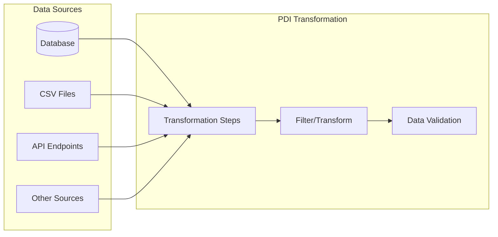
```mermaid
graph LR
    subgraph "Data Sources"
        DB[(Database)]
        CSV[CSV Files]
        API[API Endpoints]
        OTHER[Other Sources]
    end
    
    subgraph "PDI Transformation"
        TRANS[Transformation Steps]
        FILTER[Filter/Transform]
        VALIDATE[Data Validation]
    end
    
    DB --> TRANS
    CSV --> TRANS
    API --> TRANS
    OTHER --> TRANS
    
    TRANS --> FILTER
    FILTER --> VALIDATE
```

### 2. Annotation Processing Layer
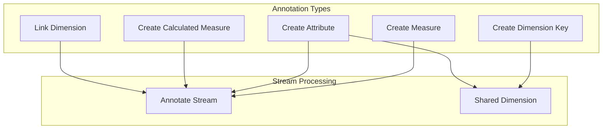
```mermaid
graph TB
    subgraph "Annotation Types"
        CM[Create Measure]
        CA[Create Attribute]
        CCM[Create Calculated Measure]
        CDK[Create Dimension Key]
        LD[Link Dimension]
    end
    
    subgraph "Stream Processing"
        AS[Annotate Stream]
        SD[Shared Dimension]
    end
    
    CM --> AS
    CA --> AS
    CCM --> AS
    CDK --> SD
    CA --> SD
    LD --> AS
```

### 3. Model Building Process
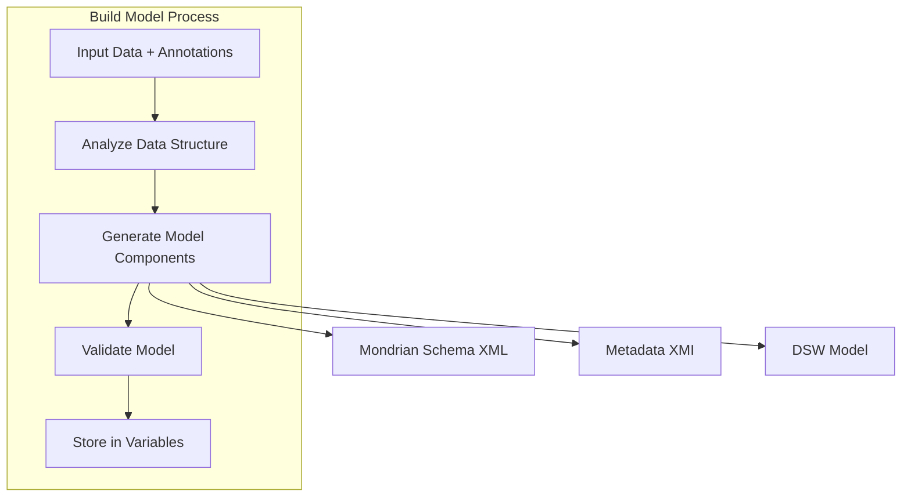
```mermaid
graph TD
    subgraph "Build Model Process"
        INPUT[Input Data + Annotations]
        ANALYZE[Analyze Data Structure]
        GENERATE[Generate Model Components]
        VALIDATE[Validate Model]
        STORE[Store in Variables]
    end
    
    INPUT --> ANALYZE
    ANALYZE --> GENERATE
    GENERATE --> VALIDATE
    VALIDATE --> STORE
    
    GENERATE --> MONDRIAN[Mondrian Schema XML]
    GENERATE --> METADATA[Metadata XMI]
    GENERATE --> DSWMODEL[DSW Model]
```

### 4. Publishing Flow
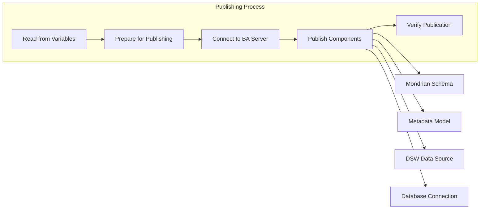
```mermaid
graph LR
    subgraph "Publishing Process"
        READ[Read from Variables]
        PREP[Prepare for Publishing]
        CONNECT[Connect to BA Server]
        PUBLISH[Publish Components]
        VERIFY[Verify Publication]
    end
    
    READ --> PREP
    PREP --> CONNECT
    CONNECT --> PUBLISH
    PUBLISH --> VERIFY
    
    PUBLISH --> MONDRIAN_PUB[Mondrian Schema]
    PUBLISH --> METADATA_PUB[Metadata Model]
    PUBLISH --> DSW_PUB[DSW Data Source]
    PUBLISH --> CONN_PUB[Database Connection]
```

## Key Data Transformations

### Annotation Processing
- **Input**: Raw field data from PDI transformations
- **Process**: Apply business logic annotations (measures, attributes, dimensions)
- **Output**: Structured annotation groups stored in MetaStore

### Model Generation
- **Input**: Annotated data + business rules
- **Process**: Generate analytical model schemas
- **Output**: Mondrian XML, Metadata XMI, DSW models

### Publishing
- **Input**: Generated models + connection info
- **Process**: Deploy to BA Server via REST APIs
- **Output**: Published data sources available for analysis

## Error Handling Flow

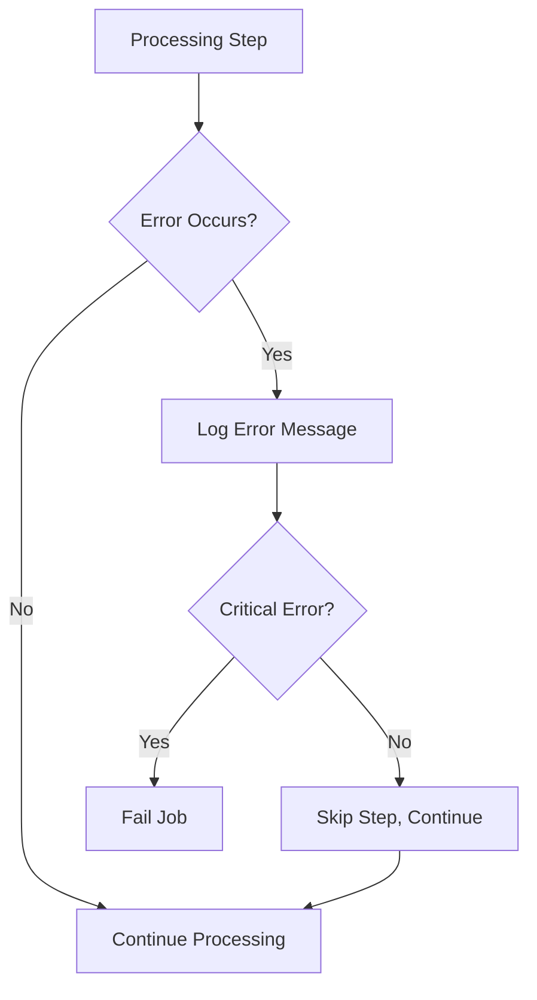
```mermaid
graph TD
    PROCESS[Processing Step] --> ERROR{Error Occurs?}
    ERROR -->|No| SUCCESS[Continue Processing]
    ERROR -->|Yes| LOG[Log Error Message]
    LOG --> VALIDATE_TYPE{Critical Error?}
    VALIDATE_TYPE -->|Yes| FAIL[Fail Job]
    VALIDATE_TYPE -->|No| SKIP[Skip Step, Continue]
    SKIP --> SUCCESS
```

## Integration Points

### MetaStore Integration
- Stores shared dimension definitions
- Manages annotation group metadata
- Provides versioning and reusability

### BA Server Integration
- REST API endpoints for publishing
- Authentication and authorization
- Conflict resolution (overwrite vs. merge)

### PDI Integration
- Native job and transformation steps
- Variable passing between components
- Error propagation and logging

## Performance Considerations

1. **Batch Processing**: Large datasets processed in chunks
2. **Caching**: MetaStore caching for frequently accessed shared dimensions
3. **Parallel Processing**: Multiple annotation streams can run concurrently
4. **Incremental Updates**: Only modified models republished

## Security Flow

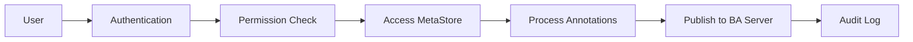
```mermaid
graph LR
    USER[User] --> AUTH[Authentication]
    AUTH --> PERM[Permission Check]
    PERM --> ACCESS[Access MetaStore]
    ACCESS --> PROCESS[Process Annotations]
    PROCESS --> PUBLISH[Publish to BA Server]
    PUBLISH --> AUDIT[Audit Log]
```

This data flow diagram shows the complete journey from raw data ingestion through model building to final publication in the Pentaho ecosystem.

## Sequence Diagrams

### 1. Complete End-to-End Processing Sequence

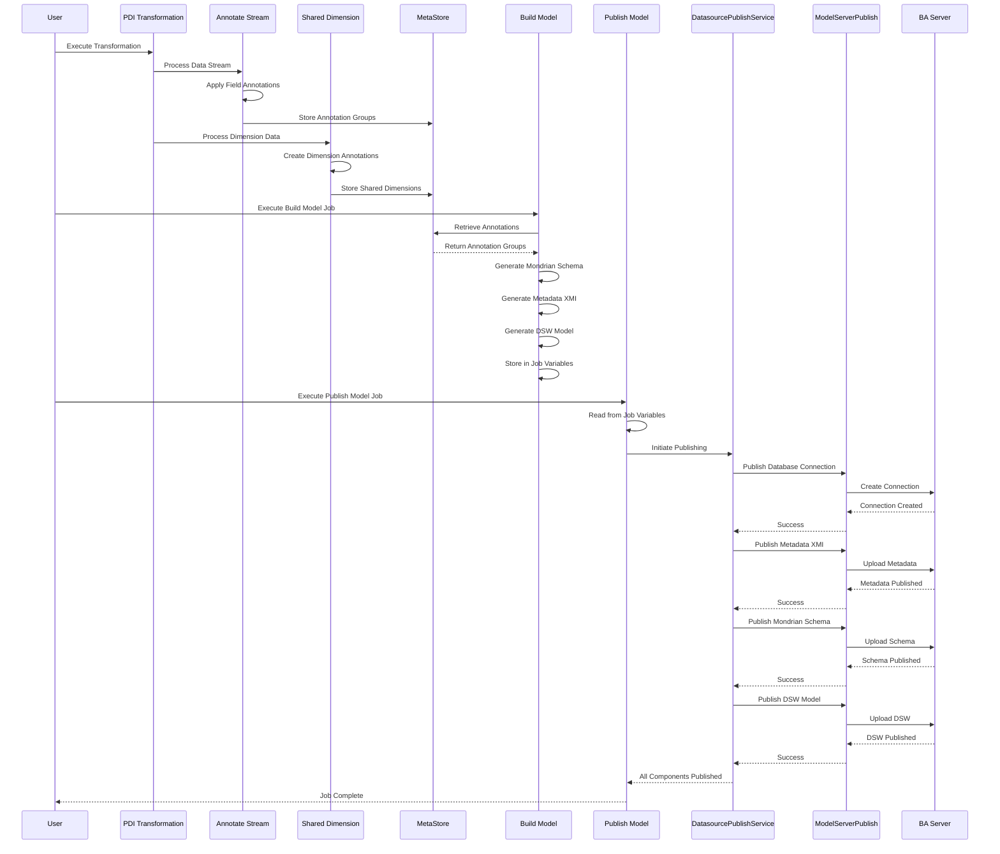
```mermaid
sequenceDiagram
    participant User
    participant PDI as PDI Transformation
    participant AS as Annotate Stream
    participant SD as Shared Dimension
    participant MS as MetaStore
    participant BM as Build Model
    participant PM as Publish Model
    participant DPS as DatasourcePublishService
    participant MSP as ModelServerPublish
    participant BA as BA Server

    User->>PDI: Execute Transformation
    PDI->>AS: Process Data Stream
    AS->>AS: Apply Field Annotations
    AS->>MS: Store Annotation Groups
    
    PDI->>SD: Process Dimension Data
    SD->>SD: Create Dimension Annotations
    SD->>MS: Store Shared Dimensions
    
    User->>BM: Execute Build Model Job
    BM->>MS: Retrieve Annotations
    MS-->>BM: Return Annotation Groups
    BM->>BM: Generate Mondrian Schema
    BM->>BM: Generate Metadata XMI
    BM->>BM: Generate DSW Model
    BM->>BM: Store in Job Variables
    
    User->>PM: Execute Publish Model Job
    PM->>PM: Read from Job Variables
    PM->>DPS: Initiate Publishing
    
    DPS->>MSP: Publish Database Connection
    MSP->>BA: Create Connection
    BA-->>MSP: Connection Created
    MSP-->>DPS: Success
    
    DPS->>MSP: Publish Metadata XMI
    MSP->>BA: Upload Metadata
    BA-->>MSP: Metadata Published
    MSP-->>DPS: Success
    
    DPS->>MSP: Publish Mondrian Schema
    MSP->>BA: Upload Schema
    BA-->>MSP: Schema Published
    MSP-->>DPS: Success
    
    DPS->>MSP: Publish DSW Model
    MSP->>BA: Upload DSW
    BA-->>MSP: DSW Published
    MSP-->>DPS: Success
    
    DPS-->>PM: All Components Published
    PM-->>User: Job Complete
```

### 2. Annotation Processing Sequence

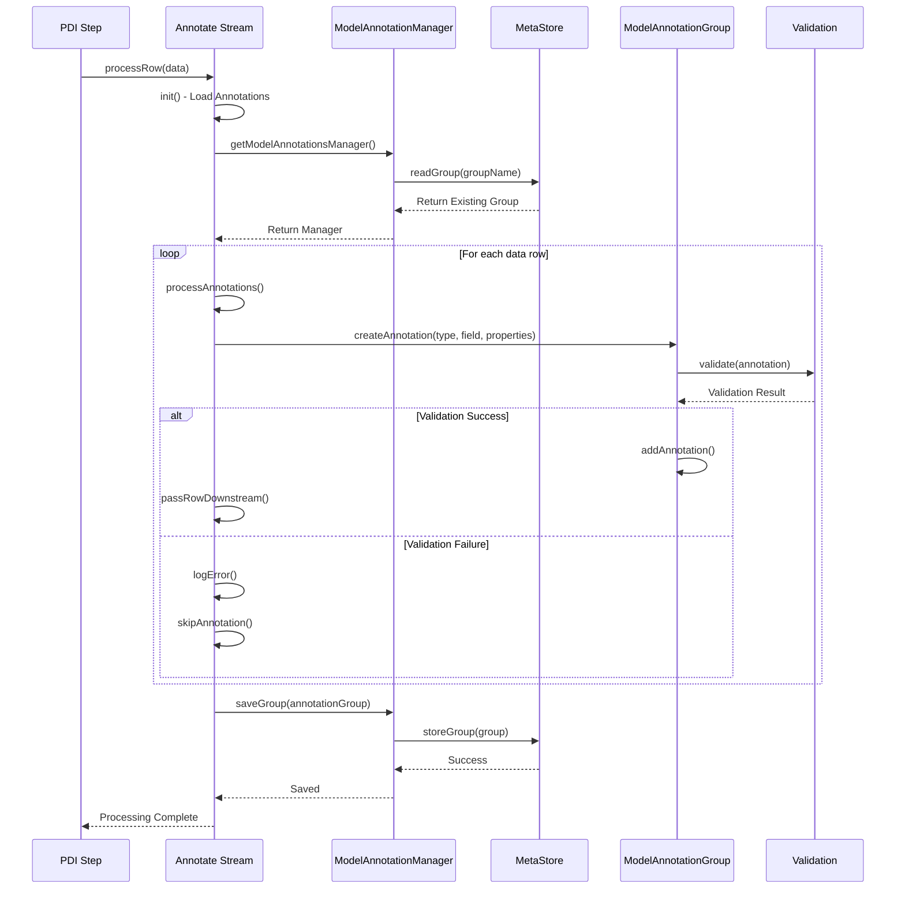
```mermaid
sequenceDiagram
    participant PDI as PDI Step
    participant AS as Annotate Stream
    participant MAM as ModelAnnotationManager
    participant MS as MetaStore
    participant MAG as ModelAnnotationGroup
    participant Validator as Validation

    PDI->>AS: processRow(data)
    AS->>AS: init() - Load Annotations
    AS->>MAM: getModelAnnotationsManager()
    MAM->>MS: readGroup(groupName)
    MS-->>MAM: Return Existing Group
    MAM-->>AS: Return Manager
    
    loop For each data row
        AS->>AS: processAnnotations()
        AS->>MAG: createAnnotation(type, field, properties)
        MAG->>Validator: validate(annotation)
        Validator-->>MAG: Validation Result
        
        alt Validation Success
            MAG->>MAG: addAnnotation()
            AS->>AS: passRowDownstream()
        else Validation Failure
            AS->>AS: logError()
            AS->>AS: skipAnnotation()
        end
    end
    
    AS->>MAM: saveGroup(annotationGroup)
    MAM->>MS: storeGroup(group)
    MS-->>MAM: Success
    MAM-->>AS: Saved
    AS-->>PDI: Processing Complete
```

### 3. Build Model Sequence

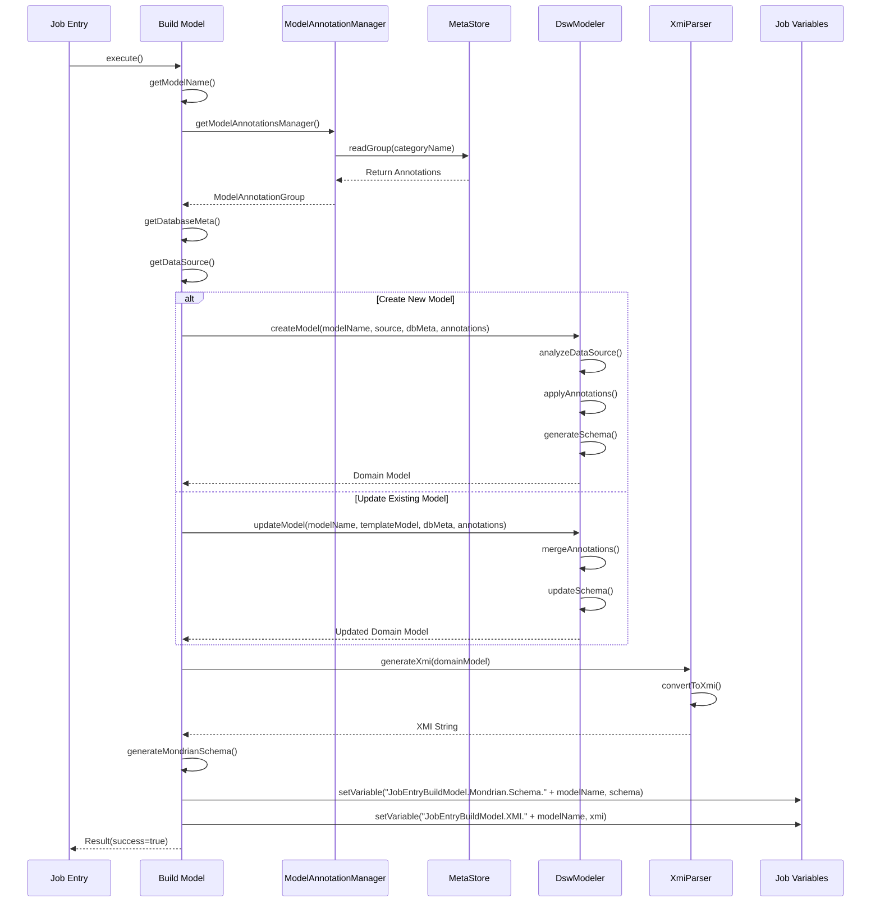
```mermaid
sequenceDiagram
    participant Job as Job Entry
    participant BM as Build Model
    participant MAM as ModelAnnotationManager
    participant MS as MetaStore
    participant Modeler as DswModeler
    participant Parser as XmiParser
    participant Vars as Job Variables

    Job->>BM: execute()
    BM->>BM: getModelName()
    BM->>MAM: getModelAnnotationsManager()
    MAM->>MS: readGroup(categoryName)
    MS-->>MAM: Return Annotations
    MAM-->>BM: ModelAnnotationGroup
    
    BM->>BM: getDatabaseMeta()
    BM->>BM: getDataSource()
    
    alt Create New Model
        BM->>Modeler: createModel(modelName, source, dbMeta, annotations)
        Modeler->>Modeler: analyzeDataSource()
        Modeler->>Modeler: applyAnnotations()
        Modeler->>Modeler: generateSchema()
        Modeler-->>BM: Domain Model
    else Update Existing Model
        BM->>Modeler: updateModel(modelName, templateModel, dbMeta, annotations)
        Modeler->>Modeler: mergeAnnotations()
        Modeler->>Modeler: updateSchema()
        Modeler-->>BM: Updated Domain Model
    end
    
    BM->>Parser: generateXmi(domainModel)
    Parser->>Parser: convertToXmi()
    Parser-->>BM: XMI String
    
    BM->>BM: generateMondrianSchema()
    BM->>Vars: setVariable("JobEntryBuildModel.Mondrian.Schema." + modelName, schema)
    BM->>Vars: setVariable("JobEntryBuildModel.XMI." + modelName, xmi)
    
    BM-->>Job: Result(success=true)
```

### 4. Publishing Sequence

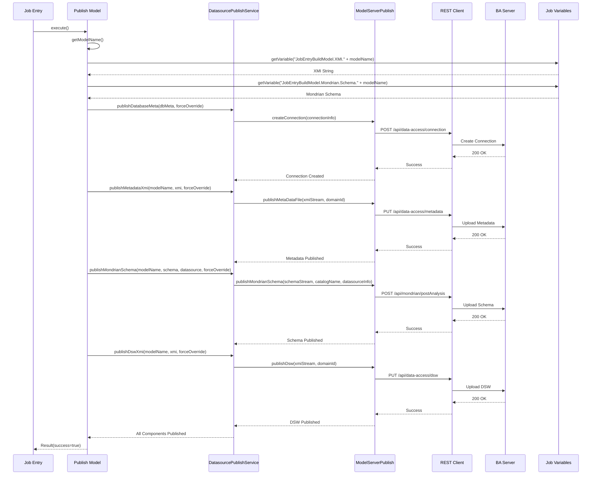
```mermaid
sequenceDiagram
    participant Job as Job Entry
    participant PM as Publish Model
    participant DPS as DatasourcePublishService
    participant MSP as ModelServerPublish
    participant REST as REST Client
    participant BA as BA Server
    participant Vars as Job Variables

    Job->>PM: execute()
    PM->>PM: getModelName()
    PM->>Vars: getVariable("JobEntryBuildModel.XMI." + modelName)
    Vars-->>PM: XMI String
    PM->>Vars: getVariable("JobEntryBuildModel.Mondrian.Schema." + modelName)
    Vars-->>PM: Mondrian Schema
    
    PM->>DPS: publishDatabaseMeta(dbMeta, forceOverride)
    DPS->>MSP: createConnection(connectionInfo)
    MSP->>REST: POST /api/data-access/connection
    REST->>BA: Create Connection
    BA-->>REST: 200 OK
    REST-->>MSP: Success
    MSP-->>DPS: Connection Created
    
    PM->>DPS: publishMetadataXmi(modelName, xmi, forceOverride)
    DPS->>MSP: publishMetaDataFile(xmiStream, domainId)
    MSP->>REST: PUT /api/data-access/metadata
    REST->>BA: Upload Metadata
    BA-->>REST: 200 OK
    REST-->>MSP: Success
    MSP-->>DPS: Metadata Published
    
    PM->>DPS: publishMondrianSchema(modelName, schema, datasource, forceOverride)
    DPS->>MSP: publishMondrianSchema(schemaStream, catalogName, datasourceInfo)
    MSP->>REST: POST /api/mondrian/postAnalysis
    REST->>BA: Upload Schema
    BA-->>REST: 200 OK
    REST-->>MSP: Success
    MSP-->>DPS: Schema Published
    
    PM->>DPS: publishDswXmi(modelName, xmi, forceOverride)
    DPS->>MSP: publishDsw(xmiStream, domainId)
    MSP->>REST: PUT /api/data-access/dsw
    REST->>BA: Upload DSW
    BA-->>REST: 200 OK
    REST-->>MSP: Success
    MSP-->>DPS: DSW Published
    
    DPS-->>PM: All Components Published
    PM-->>Job: Result(success=true)
```

### 5. Shared Dimension Processing Sequence

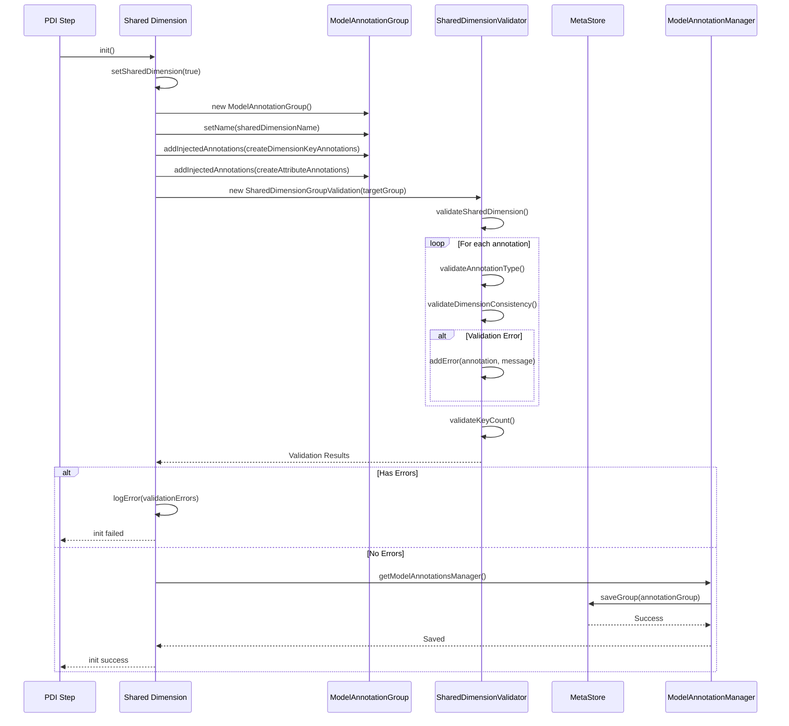
```mermaid
sequenceDiagram
    participant PDI as PDI Step
    participant SD as Shared Dimension
    participant MAG as ModelAnnotationGroup
    participant Validator as SharedDimensionValidator
    participant MS as MetaStore
    participant MAM as ModelAnnotationManager

    PDI->>SD: init()
    SD->>SD: setSharedDimension(true)
    SD->>MAG: new ModelAnnotationGroup()
    SD->>MAG: setName(sharedDimensionName)
    
    SD->>MAG: addInjectedAnnotations(createDimensionKeyAnnotations)
    SD->>MAG: addInjectedAnnotations(createAttributeAnnotations)
    
    SD->>Validator: new SharedDimensionGroupValidation(targetGroup)
    Validator->>Validator: validateSharedDimension()
    
    loop For each annotation
        Validator->>Validator: validateAnnotationType()
        Validator->>Validator: validateDimensionConsistency()
        
        alt Validation Error
            Validator->>Validator: addError(annotation, message)
        end
    end
    
    Validator->>Validator: validateKeyCount()
    Validator-->>SD: Validation Results
    
    alt Has Errors
        SD->>SD: logError(validationErrors)
        SD-->>PDI: init failed
    else No Errors
        SD->>MAM: getModelAnnotationsManager()
        MAM->>MS: saveGroup(annotationGroup)
        MS-->>MAM: Success
        MAM-->>SD: Saved
        SD-->>PDI: init success
    end
```

### 6. Error Handling Sequence

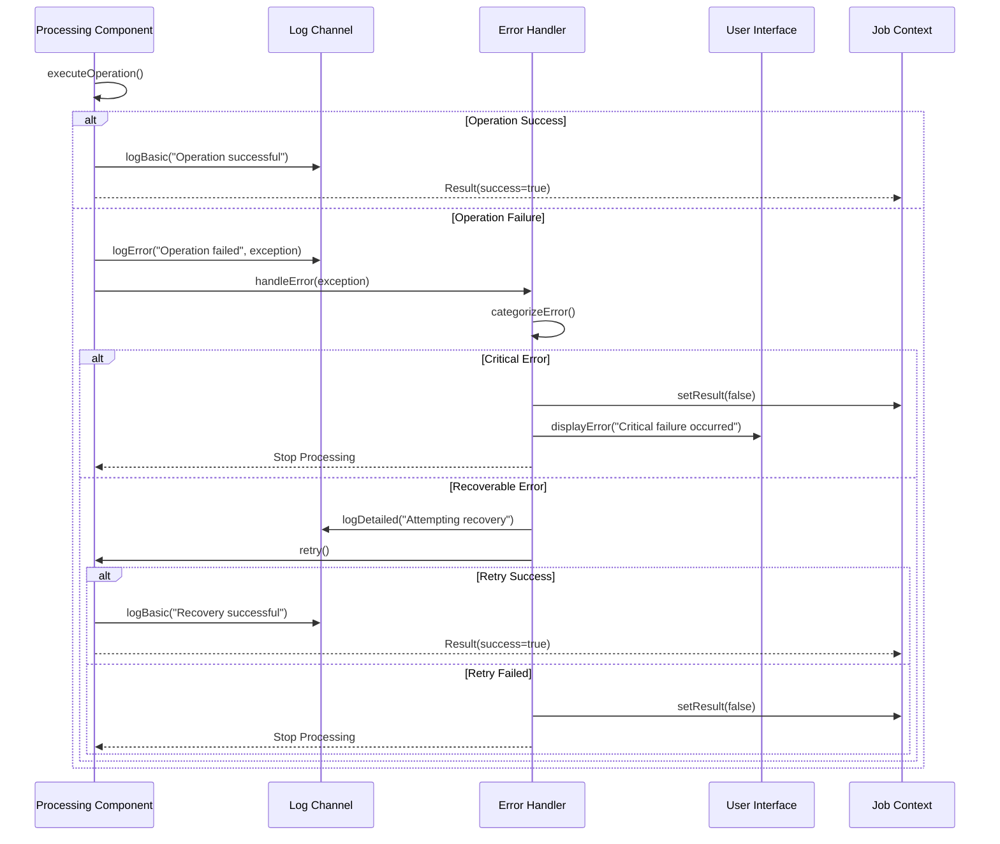
```mermaid
sequenceDiagram
    participant Component as Processing Component
    participant Logger as Log Channel
    participant ErrorHandler as Error Handler
    participant User as User Interface
    participant Job as Job Context

    Component->>Component: executeOperation()
    
    alt Operation Success
        Component->>Logger: logBasic("Operation successful")
        Component-->>Job: Result(success=true)
    else Operation Failure
        Component->>Logger: logError("Operation failed", exception)
        Component->>ErrorHandler: handleError(exception)
        
        ErrorHandler->>ErrorHandler: categorizeError()
        
        alt Critical Error
            ErrorHandler->>Job: setResult(false)
            ErrorHandler->>User: displayError("Critical failure occurred")
            ErrorHandler-->>Component: Stop Processing
        else Recoverable Error
            ErrorHandler->>Logger: logDetailed("Attempting recovery")
            ErrorHandler->>Component: retry()
            
            alt Retry Success
                Component->>Logger: logBasic("Recovery successful")
                Component-->>Job: Result(success=true)
            else Retry Failed
                ErrorHandler->>Job: setResult(false)
                ErrorHandler-->>Component: Stop Processing
            end
        end
    end
```

## Optimization and Refactoring Recommendations

Based on the analysis of the Pentaho Data Refinery codebase, here are key optimization and refactoring recommendations:

### 1. Architecture Optimization

#### Current Issues:
- **Tight Coupling**: Direct dependencies between components limit flexibility
- **Monolithic Design**: Large classes handling multiple responsibilities
- **Synchronous Processing**: Blocking operations impact performance
- **Resource Management**: Inefficient stream and connection handling

#### Recommendations:

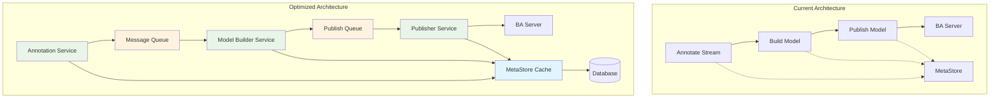
```mermaid
graph TB
    subgraph "Current Architecture"
        A1[Annotate Stream] --> B1[Build Model]
        B1 --> C1[Publish Model]
        C1 --> D1[BA Server]
        
        A1 -.-> MS1[MetaStore]
        B1 -.-> MS1
        C1 -.-> MS1
    end
    
    subgraph "Optimized Architecture"
        A2[Annotation Service] --> Q[Message Queue]
        Q --> B2[Model Builder Service]
        B2 --> Q2[Publish Queue]
        Q2 --> C2[Publisher Service]
        C2 --> D2[BA Server]
        
        A2 --> MS2[MetaStore Cache]
        B2 --> MS2
        C2 --> MS2
        MS2 --> DB[(Database)]
    end
    
    style A2 fill:#e8f5e8
    style B2 fill:#e8f5e8
    style C2 fill:#e8f5e8
    style Q fill:#fff3e0
    style Q2 fill:#fff3e0
    style MS2 fill:#e1f5fe
```

### 2. Performance Optimizations

#### 2.1 Streaming and Batch Processing

**Current Implementation Issues:**
```java
// Current: Memory-intensive approach
List<ModelAnnotation> annotations = new ArrayList<>();
for (Object[] row : allRows) {
    annotations.add(processRow(row));
}
```

**Recommended Optimization:**
```java
// Optimized: Streaming approach
Stream<Object[]> rowStream = getDataStream();
rowStream
    .parallel()
    .map(this::processRow)
    .filter(Objects::nonNull)
    .collect(Collectors.toList());
```

#### 2.2 MetaStore Caching Strategy

**Current Problems:**
- Repeated MetaStore queries for same data
- No cache invalidation strategy
- Synchronous read/write operations

**Recommended Caching Layer:**
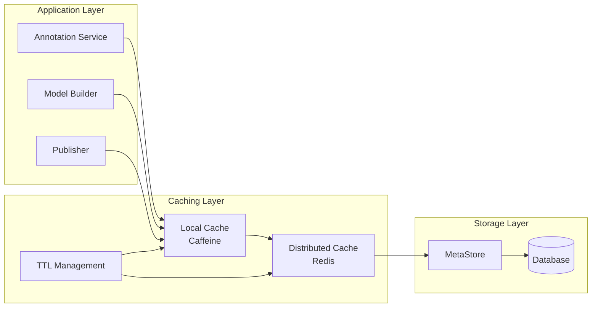
```mermaid
graph LR
    subgraph "Application Layer"
        A[Annotation Service]
        B[Model Builder]
        C[Publisher]
    end
    
    subgraph "Caching Layer"
        L1[Local Cache<br/>Caffeine]
        L2[Distributed Cache<br/>Redis]
        TTL[TTL Management]
    end
    
    subgraph "Storage Layer"
        MS[MetaStore]
        DB[(Database)]
    end
    
    A --> L1
    B --> L1
    C --> L1
    L1 --> L2
    L2 --> MS
    MS --> DB
    
    TTL --> L1
    TTL --> L2
```

#### 2.3 Connection Pool Optimization

**Current Issues:**
```java
// Current: New connection per request
ModelServerPublish publisher = new ModelServerPublish();
publisher.publishMetaDataFile(stream, domainId);
```

**Recommended Connection Pooling:**
```java
// Optimized: Connection pooling
@Component
public class ConnectionPoolManager {
    private final ConnectionPool pool;
    
    public ClientResponse executeRequest(RequestBuilder builder) {
        return pool.executeWithConnection(builder);
    }
}
```

### 3. Code Quality Improvements

#### 3.1 Dependency Injection Refactoring

**Current Issues:**
- Hard-coded dependencies
- Difficult to test
- Poor separation of concerns

**Recommended Refactoring:**
```java
// Current problematic code
public class JobEntryDatasourcePublish {
    private DatasourcePublishService datasourcePublishService;
    
    protected ModelServerPublish getModelServerPublish() {
        return new ModelServerPublish(getLogChannel());
    }
}

// Improved version
@Component
public class JobEntryDatasourcePublish {
    private final DatasourcePublishService publishService;
    private final ModelServerPublishFactory publishFactory;
    
    @Autowired
    public JobEntryDatasourcePublish(
        DatasourcePublishService publishService,
        ModelServerPublishFactory publishFactory) {
        this.publishService = publishService;
        this.publishFactory = publishFactory;
    }
}
```

#### 3.2 Error Handling Strategy

**Current Issues:**
- Inconsistent error handling
- Limited retry mechanisms
- Poor error recovery

**Recommended Error Handling Pattern:**
```java
@Component
public class ResilientPublishService {
    private final RetryTemplate retryTemplate;
    private final CircuitBreaker circuitBreaker;
    
    public PublishResult publishWithResilience(PublishRequest request) {
        return circuitBreaker.executeSupplier(() -> 
            retryTemplate.execute(context -> 
                performPublish(request)
            )
        );
    }
}
```

### 4. Data Processing Optimizations

#### 4.1 Annotation Processing Pipeline

**Current Sequential Processing:**
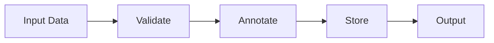
```mermaid
graph LR
    A[Input Data] --> B[Validate]
    B --> C[Annotate]
    C --> D[Store]
    D --> E[Output]
```

**Optimized Parallel Processing:**
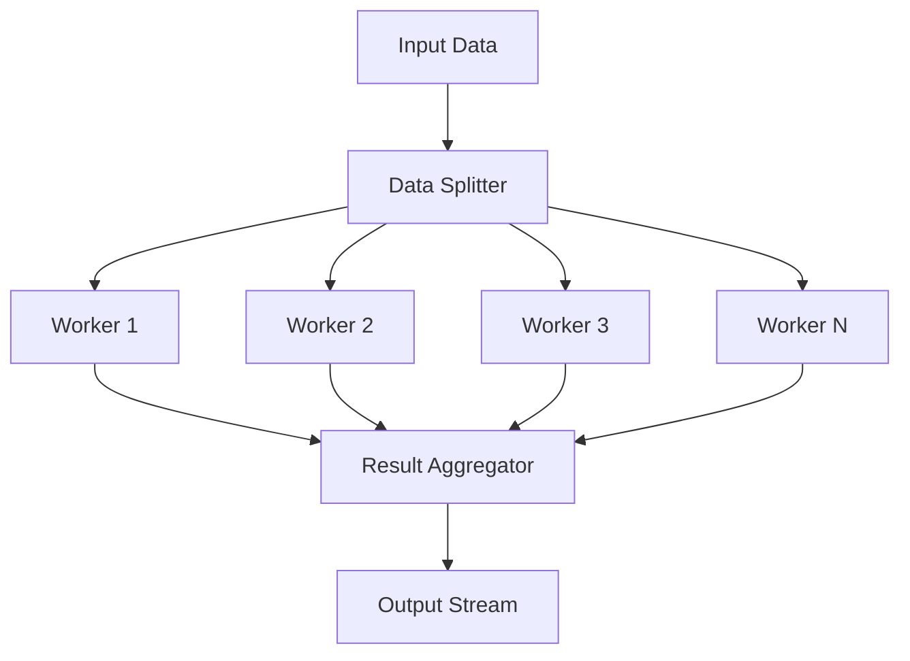
```mermaid
graph TB
    A[Input Data] --> B[Data Splitter]
    B --> C1[Worker 1]
    B --> C2[Worker 2]
    B --> C3[Worker 3]
    B --> C4[Worker N]
    
    C1 --> D[Result Aggregator]
    C2 --> D
    C3 --> D
    C4 --> D
    
    D --> E[Output Stream]
```

#### 4.2 Model Building Optimization

**Memory Usage Reduction:**
```java
// Current: Load entire model in memory
Domain domain = modeler.createModel(modelName, source, dbMeta, annotations);

// Optimized: Streaming model creation
StreamingModelBuilder builder = new StreamingModelBuilder();
builder.withSource(source)
       .withAnnotations(annotations)
       .buildToStream(outputStream);
```

### 5. Scalability Improvements

#### 5.1 Microservices Architecture

**Recommended Service Decomposition:**
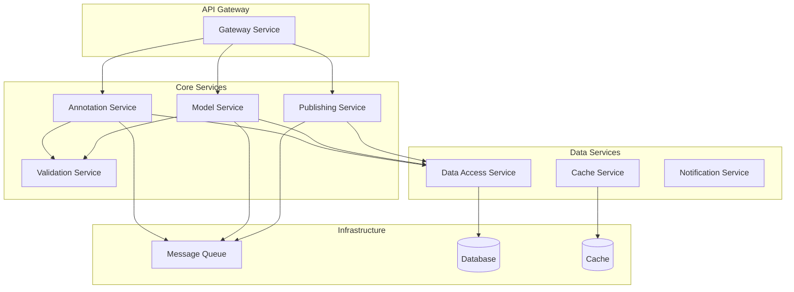
```mermaid
graph TB
    subgraph "API Gateway"
        GW[Gateway Service]
    end
    
    subgraph "Core Services"
        AS[Annotation Service]
        MS[Model Service]
        PS[Publishing Service]
        VS[Validation Service]
    end
    
    subgraph "Data Services"
        DS[Data Access Service]
        CS[Cache Service]
        NS[Notification Service]
    end
    
    subgraph "Infrastructure"
        MQ[Message Queue]
        DB[(Database)]
        CACHE[(Cache)]
    end
    
    GW --> AS
    GW --> MS
    GW --> PS
    
    AS --> DS
    MS --> DS
    PS --> DS
    
    AS --> VS
    MS --> VS
    
    DS --> DB
    CS --> CACHE
    
    AS --> MQ
    MS --> MQ
    PS --> MQ
```

#### 5.2 Event-Driven Architecture

**Current Synchronous Flow:**
```java
// Current: Blocking operations
buildModel();
publishModel();
notifyUsers();
```

**Recommended Event-Driven Flow:**
```java
// Optimized: Event-driven
@EventListener
public void onModelBuilt(ModelBuiltEvent event) {
    publishingService.publishAsync(event.getModel());
}

@EventListener
public void onModelPublished(ModelPublishedEvent event) {
    notificationService.notifyUsers(event.getPublishResult());
}
```

### 6. Security Enhancements

#### 6.1 Authentication and Authorization

**Current Issues:**
- Basic authentication only
- No role-based access control
- Limited audit logging

**Recommended Security Architecture:**
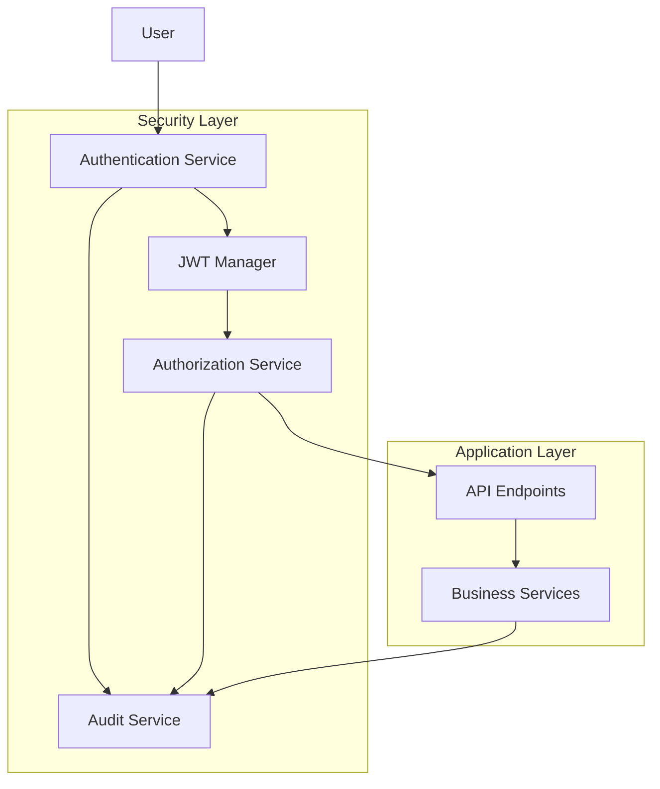
```mermaid
graph TB
    subgraph "Security Layer"
        AUTH[Authentication Service]
        AUTHZ[Authorization Service]
        AUDIT[Audit Service]
        JWT[JWT Manager]
    end
    
    subgraph "Application Layer"
        API[API Endpoints]
        SVC[Business Services]
    end
    
    USER[User] --> AUTH
    AUTH --> JWT
    JWT --> AUTHZ
    AUTHZ --> API
    API --> SVC
    
    AUTH --> AUDIT
    AUTHZ --> AUDIT
    SVC --> AUDIT
```

### 7. Monitoring and Observability

#### 7.1 Metrics and Monitoring

**Recommended Monitoring Stack:**
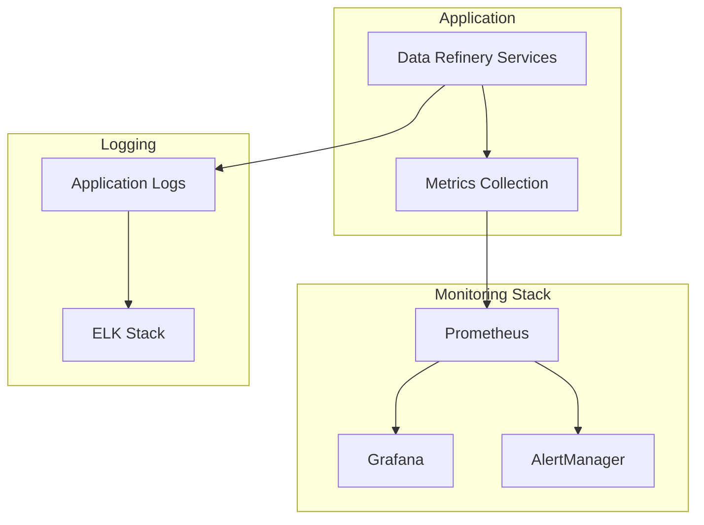
```mermaid
graph TB
    subgraph "Application"
        APP[Data Refinery Services]
        METRICS[Metrics Collection]
    end
    
    subgraph "Monitoring Stack"
        PROM[Prometheus]
        GRAF[Grafana]
        ALERT[AlertManager]
    end
    
    subgraph "Logging"
        LOG[Application Logs]
        ELK[ELK Stack]
    end
    
    APP --> METRICS
    METRICS --> PROM
    PROM --> GRAF
    PROM --> ALERT
    
    APP --> LOG
    LOG --> ELK
```

#### 7.2 Health Checks and Circuit Breakers

**Recommended Health Check Strategy:**
```java
@Component
public class DataRefineryHealthIndicator implements HealthIndicator {
    
    @Override
    public Health health() {
        return Health.up()
            .withDetail("metastore", checkMetaStore())
            .withDetail("baServer", checkBAServer())
            .withDetail("database", checkDatabase())
            .build();
    }
}
```

### 8. Testing Strategy Improvements

#### 8.1 Test Automation Pipeline

**Current Testing Gaps:**
- Limited integration tests
- No performance testing
- Manual testing dependency

**Recommended Testing Strategy:**
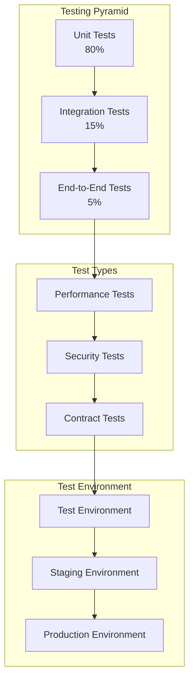
```mermaid
graph TB
    subgraph "Testing Pyramid"
        UT[Unit Tests<br/>80%]
        IT[Integration Tests<br/>15%]
        E2E[End-to-End Tests<br/>5%]
    end
    
    subgraph "Test Types"
        PERF[Performance Tests]
        SEC[Security Tests]
        CONTRACT[Contract Tests]
    end
    
    subgraph "Test Environment"
        TEST[Test Environment]
        STAGING[Staging Environment]
        PROD[Production Environment]
    end
    
    UT --> IT
    IT --> E2E
    E2E --> PERF
    PERF --> SEC
    SEC --> CONTRACT
    
    CONTRACT --> TEST
    TEST --> STAGING
    STAGING --> PROD
```

### 9. Configuration Management

#### 9.1 Externalized Configuration

**Current Issues:**
- Hard-coded configuration values
- No environment-specific configurations
- Limited configuration validation

**Recommended Configuration Strategy:**
```yaml
# application.yml
data-refinery:
  metastore:
    connection-pool:
      min-size: 5
      max-size: 20
      timeout: 30s
  
  publishing:
    batch-size: 100
    retry-attempts: 3
    timeout: 60s
  
  cache:
    provider: redis
    ttl: 3600s
    max-size: 10000
```

### 10. Implementation Priority Matrix

```mermaid
graph TB
    subgraph "High Impact, Low Effort"
        H1[Connection Pooling]
        H2[Caching Layer]
        H3[Error Handling]
        H4[Configuration Externalization]
    end
    
    subgraph "High Impact, High Effort"
        H5[Microservices Architecture]
        H6[Event-Driven Design]
        H7[Streaming Processing]
        H8[Security Enhancements]
    end
    
    subgraph "Low Impact, Low Effort"
        L1[Code Cleanup]
        L2[Documentation]
        L3[Logging Improvements]
        L4[Unit Test Coverage]
    end
    
    subgraph "Low Impact, High Effort"
        L5[Complete Rewrite]
        L6[Technology Migration]
    end
    
    style H1 fill:#4caf50
    style H2 fill:#4caf50
    style H3 fill:#4caf50
    style H4 fill:#4caf50
    style H5 fill:#ff9800
    style H6 fill:#ff9800
    style H7 fill:#ff9800
    style H8 fill:#ff9800
```

### 11. Migration Strategy

#### Phase 1: Quick Wins (1-2 months)
- Implement connection pooling
- Add caching layer
- Improve error handling
- Externalize configuration

#### Phase 2: Architecture Improvements (3-6 months)
- Refactor for dependency injection
- Implement streaming processing
- Add comprehensive monitoring
- Enhance security

#### Phase 3: Scalability Enhancements (6-12 months)
- Microservices decomposition
- Event-driven architecture
- Advanced caching strategies
- Performance optimization

### 12. Risk Assessment

| Risk | Impact | Probability | Mitigation |
|------|--------|-------------|------------|
| Performance Degradation | High | Medium | Gradual rollout with monitoring |
| Breaking Changes | High | Low | Comprehensive testing |
| Resource Constraints | Medium | High | Phased implementation |
| User Training | Low | High | Documentation and training |

These recommendations focus on improving performance, scalability, maintainability, and reliability while maintaining backward compatibility where possible.
